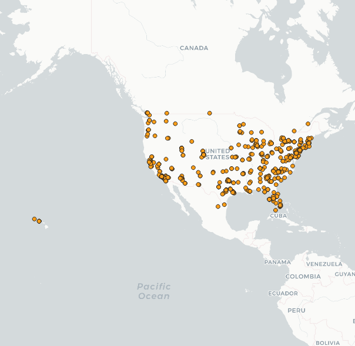
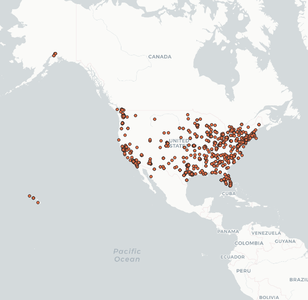
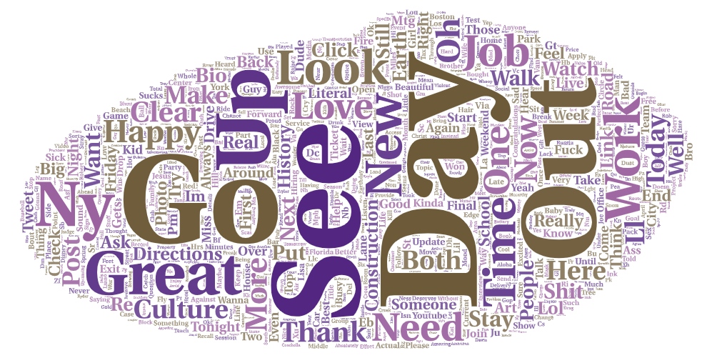
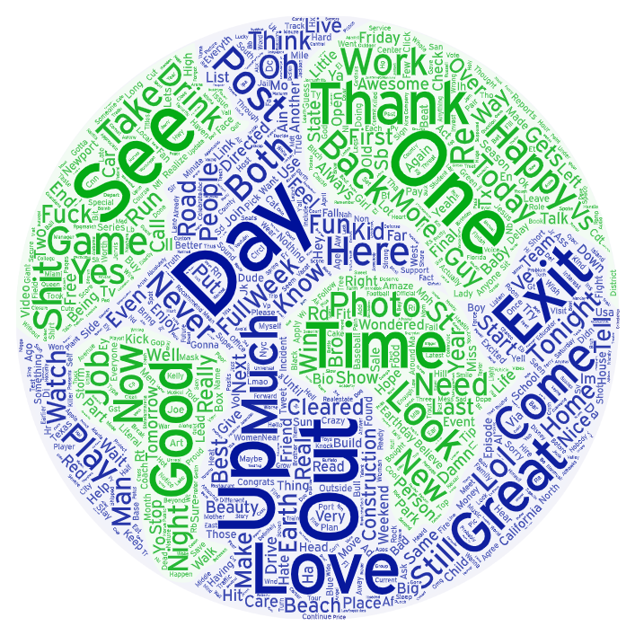

# geog458_lab2

## Travis Le

In this project, we are introduced to Geo-tagged Twitter data using an API-based crawler and visualize them on a map using a mapping tool QGIS. From the data crawler, we can gather data about different locations based on coordinates, about specific topics, or about certain users based on their Twitter ID.

For this assignment, I chose to investigate tweets in the USA, including Hawaii and Alaska at two different points of time during the day. One is early in the morning and the other is later in the afternoon to compare the trend of topics over time with the words cloud visualization.

- First map (early morning)

- Second map (late afternoon)

Without looking at the word cloud visualization and just inspecting the two maps. First, we can see that the majority of the tweets are on the coast and scatter only a few for the Midwest, this can be explained by the population focus being mainly on the coast. Second, we can also see that for early in the morning there are not a lot of tweets coming from Hawaii or Alaska compare to later in the day, this can be explained by the time zone difference, it could be that earlier in the day some users are not active yet in those regions.

Moving on we now take a look at the two different word cloud that was produced based on the data collected. 

- Morning word cloud:

- Afternoon word cloud:

Looking at the two different word clouds we can see some of the words that stand out such as Day, Go, Good, and Great. Considering the date that this data was collected was on Earth Day, which explains some of the words, we can see that most people are tweeting about Earth Day. 

This is very interesting to see how the trend of tweets is during the day, moving forward I would like to expand on this and gather tweets based on specific topics or users. 
